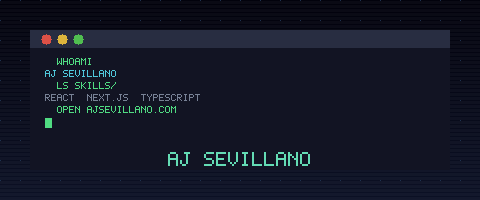

<div align="center">
  

  [](https://nextjs.org/)
  [](https://www.typescriptlang.org/)
  [](https://sass-lang.com/)
  [](https://jestjs.io/)

  **🧑‍💻 My personal portfolio — built with Next.js, TypeScript, and a working contact form. Check it out live 🚀**

  [**ajsevillano.com**](https://www.ajsevillano.com)

</div>

---

## ✨ Features

- 🎨 **Responsive layout** built with SCSS modules — mobile-first
- 📬 **Working contact form** powered by Nodemailer (no third-party form service)
- 🎞️ **Lottie animations** for fluid, lightweight motion
- 🧪 **Unit tested** with Jest and React Testing Library
- 🔒 **Pre-commit hooks** via Husky to keep quality consistent

## 🚀 Run locally

```bash
npm install
npm run dev
```

Open `http://localhost:3000`.

## 🧪 Tests

```bash
npm test
```

## 🏗️ Build

```bash
npm run build
npm start
```

## 🛠️ Tech Stack

- **Next.js 12** (Pages Router) + **React 18**
- **TypeScript**
- **SCSS modules** — component-scoped styles
- **Nodemailer** — email delivery from the contact form API route
- **Lottie Web** — JSON-based animations
- **Jest** + **React Testing Library**
- **Husky** — pre-commit quality gate
